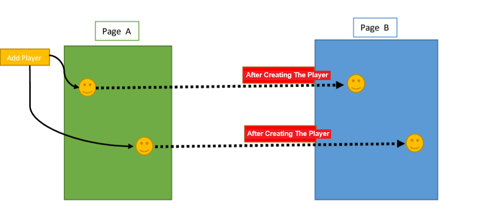

# Live Icon Mover Game
Live Icon Mover Game using socket.io and node.js

## معرفی 
این پروژه یک نمونه ساده از یک برنامه تعاملی و هماهنگی در زمان واقعی با استفاده از WebSocket و Node.js است. در این پروژه، یک صفحه وب ساده داریم که در آن می‌توانیم آیکون‌ها را به یک ناحیه مشخص در صفحه اضافه کنیم و آن‌ها را به طور لحظه‌ای با هماهنگی بین تمام مرورگرها جابه‌جا کنیم.

عملکرد اصلی این پروژه به این صورت است:

1. زمانی که کاربر روی دکمه "Add Icon" کلیک می‌کند، یک آیکون به طور تصادفی به ناحیه مشخص در صفحه اضافه می‌شود.
2. زمانی که کاربر روی یک آیکون کلیک می‌کند و آن را جابجا می‌کند، موقعیت جدید آیکون به صورت لحظه‌ای به سرور ارسال می‌شود و سپس به تمام کلاینت‌ها منتقل می‌شود تا همه آیکون‌ها در همه مرورگرها هماهنگ شوند.
3. رنگ هر آیکون نیز به صورت تصادفی تولید می‌شود و در همه مرورگرها هماهنگ است.

به این ترتیب، با استفاده از WebSocket و Node.js، ما ایجاد یک برنامه ساده اما تعاملی را فراهم می‌کنیم که کاربران می‌توانند در آن به صورت همزمان با هم تعامل کنند و تغییراتی که در یک مرورگر اعمال می‌شود، به صورت لحظه‌ای در مرورگرهای دیگر نیز نمایش داده می‌شود.

## پیش نمایش 


دو صفحه وب  A و B رادرنظربگيريد درصفحه A با زدن یک دکمه، یک بازیکن با موقیعت یکسان در زمین هر دو صفحه A و B بازی اضافه می‌شود. 
لازم به ذکر است که موقعیت بازیکن اضافه شده در زمین باید در هر صفحه یکسان باشد و همچنین، هنگامی که موقعیت یک بازیکن در صفحه A یا B تغییر می‌کند، باید این تغییر در هر دو صفحه نیز اعمال شود. 




## نصب 
برای اجرای پروژه، مراحل زیر را دنبال کنید:

```bash
npm install
```

```bash 
npm run dev
```