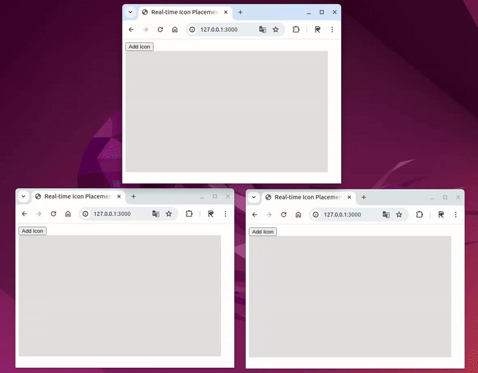
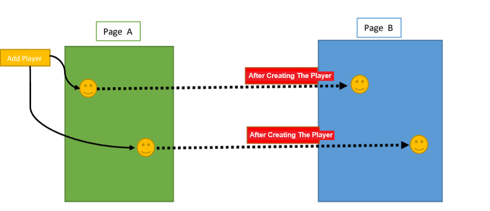

# Live Icon Mover Game
Live Icon Mover Game using socket.io and node.js
## Introduction
This project is a simple example of an interactive real-time application using WebSocket and Node.js. In this project, we have a simple web page where we can add icons to a specified area on the page and move them around with real-time synchronization between all browsers.

The main functionality of this project is as follows:

1. When the user clicks the "Add Icon" button, a randomly positioned icon is added to a specified area on the page.
2. When the user clicks on an icon and moves it around, the new position of the icon is sent to the server in real-time and then broadcasted to all clients, so all icons in all browsers stay synchronized.
3. The color of each icon is also randomly generated and synchronized across all browsers.

In this way, using WebSocket and Node.js, we create a simple but interactive application where users can interact with each other in real-time, and changes made in one browser are instantly reflected in other browsers as well.

## Demo


Consider two web pages, A and B. In page A, upon pressing a button, a player with the same position on the field is added to the game in both pages A and B. It's worth mentioning that the position of the added player on the field must be the same on each page, and furthermore, when the position of a player changes in page A or B, this change should be reflected on both pages.



## Installation
follow the following steps to run the project:

```bash
npm install
```

```bash 
npm run dev
```
